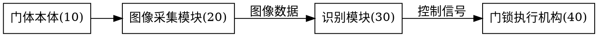

# Generating the Drawings (附图)

Role: **discipline** of the self-service group (ADR-0009). On completion, update the 附图 stage in `草稿/申请信息.md`.

Standards pointer: `../patent-standards/references/cn-invention-utility.md` and the applicable design reference. This skill uses the pointer; it does not reproduce statutory text.

Input: the claims + the specification text. Drawings are not free composition — they mirror the specification text (the text and drawings must use the same reference-numeral set).

## Prerequisite

```bash
dot -V   # if absent, state the missing dependency explicitly; do not force drawing
```

## Working protocol, every step with a completion standard

### Step 1 Extract the numeral list → Done when: the list matches the specification item by item

Extract every "<name>(<numeral>)" from the specification text and build the numeral table:

```
10 门体本体     20 图像采集模块   22 红外摄像头   24 广角镜头
30 识别模块     40 门锁执行机构   50 通信接口
```

Check: parts mentioned in the text without numerals get numerals; parts you want to draw that the text never mentions — either add them to the text or don't draw them.

### Step 2 Draw → Done when: each figure corresponds to a specification paragraph, all numerals come from the list

Render with Graphviz DOT into the layered figure workspace (ADR-0008; layout in `../patent-intake/SKILL.md` "Workspace layout"): `源文件/` holds the `.dot` sources, `预览/` the svg previews, `嵌入/` the png bitmaps used for Word embedding and filing. Output under `patent-application/附图/`:



```bash
cd patent-application/附图
mkdir -p 源文件 预览 嵌入
dot -Tsvg 源文件/fig1.dot -o 预览/fig1.svg   # svg preview / version retention
dot -Tpng 源文件/fig1.dot -o 嵌入/fig1.png   # png for Word inline embedding / filing; black-white line art fits practice
```

The `.md` drafts (草稿/说明书.md, 草稿/技术交底书.md) reference each figure as `../附图/嵌入/figN.png`.

Figure checks:
- Figures are numbered "图1, 图2, …" in order, one-to-one with the "brief description of drawings" in the specification.
- No annotations beyond essential words in a figure (no parameter values, no explanatory text).
- Line style: black-white line art; no color figures, photos, or gray shading (practice).
- One view per figure, one subject per view (overall view / partial enlarged view / flowchart drawn separately).

### Step 3 Cross-check → Done when: both directions, zero omissions

- Direction A: every figure listed in the "brief description of drawings" exists among the drawings.
- Direction B: every numeral in the drawings is mentioned in the specification text; the same part carries the same numeral .
- Reference numerals in the claims: only inside parentheses after the feature, never as limitations — the claims are patent-drafting's domain; here only the numeral digits are checked.

### Step 4 Designate the abstract figure → Done when: a sensible figure is chosen and recorded

When there are drawings, choose the single figure that best illustrates the technical features as the abstract figure, and record it in `草稿/附图说明.md`. Selection standard: the figure containing the independent claim's distinguishing feature (usually the system architecture figure or the main flowchart), not a partial detail figure.

## Utility model mandatory items

A utility model **must** have drawings showing the shape / construction / combination of the product Missing structural drawings are a delivery blocker; after drawing, self-check for at least one structural figure first.

## Design (外观设计, six-view trigger → redirect)

A design's "drawings" are **pictures or photographs** not dot-rendered line diagrams — **dot does not apply**. The view rules (number of views per the faces the design points involve, six orthographic views, omitted-view statements, black-white/gray, view naming) have their single executable version in `../patent-intake/references/design-points.md`; this skill does not repeat the rules.

## Completion standard (before handover)

- [ ] Numeral list matches the specification text in both directions (Steps 1 + 3)
- [ ] Figure-number order consistent with the brief description of drawings
- [ ] Black-white line art, no stray annotations
- [ ] Abstract figure designated (utility model: structural figure preferred)
- [ ] Utility model: has a structural figure
- [ ] Every figure produced as both `预览/figN.svg` and `嵌入/figN.png` (Word embedding figures generated, none missing)
- [ ] 附图 stage updated in `草稿/申请信息.md`
