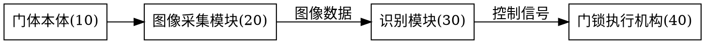

# 说明书附图生成

输入:权利要求书 + 说明书文字。附图不是自由发挥,是说明书文字的镜像(细则第21条:文字未提及的标记不得出现在附图中,反之亦然)。

## 前置

```bash
dot -V   # 无此命令则明确告知缺依赖,不硬画
```

## 工作协议,每步有完成标准

### 步骤1 提取标记清单 → 完成标准:清单与说明书逐条对上

从说明书文字提取所有"<名称>(<编号>)"标记,生成标记表:

```
10 门体本体     20 图像采集模块   22 红外摄像头   24 广角镜头
30 识别模块     40 门锁执行机构   50 通信接口
```

检查:说明书提到但无编号的组成部分,补编号;附图想画但文字没写的,要么回说明书补写,要么不画。

### 步骤2 画图 → 完成标准:每幅图对应说明书一段,标记全部来自清单

用 Graphviz DOT 渲染(输出到 `patent-application/附图/`):



```bash
dot -Tsvg fig1.dot -o fig1.svg   # svg 预览/版本留档
dot -Tpng fig1.dot -o fig1.png   # png 供 Word 内联嵌入(conversion 交付链);黑白线条图符合实务
```

规则(细则第21条):
- 图按"图1,图2,…"顺序编号,与说明书"附图说明"一一对应。
- 图中除必需的词语外不含有其他注释(参数值、解释文字不进图)。
- 线型:黑白线条图,不用彩图、照片、灰度阴影(实务惯例)。
- 每幅图:一个视图一个主题(整体图/局部放大图/流程图分开画)。

### 步骤3 交叉核对 → 完成标准:双向零遗漏

- 方向A:说明书"附图说明"列的每幅图,附图里都存在。
- 方向B:附图里的每个标记,说明书文字都提过;同一组成部分标记一致(细则第21条)。
- 权利要求里的附图标记:只放在特征后的括号内,不充当限定(细则第22条)——权利要求交 patent-claims 管,这里只核对标记数字。

### 步骤4 指定摘要附图 → 完成标准:选图合理,已写入附图说明

按细则第26条:有附图时,从全部图中选最能说明技术特征的一幅作摘要附图,记录到 `附图说明.md`。选图标准:包含独权区别特征的图(通常是系统结构图或主流程图),不是局部细节图。

## 实用新型强制项

实用新型**必须**有表示产品形状/构造/结合的附图(细则第20条/第43条)。缺图 = 受理/申请日风险,画完先自查有没有至少一幅结构图。

## 外观设计附图(六面正投影视图 + 立体图)

外观设计申请文件的"附图"是**图片或照片**(专利法第27条),不是 dot 渲染的线条示意图——**dot 不适用**。

- 视图清单按**设计要点涉及的面数**定(指南 第一部分第三章 4.2):涉及六面 → 主/后/左/右/俯/仰六面正投影视图;只涉及一面或几面 → 提交所涉及面的正投影视图(其他面可补立体图)。对称/相同面、使用时不轻易看到的面可省略,省略视图必须在简要说明中写明原因。
- 素材由**发明人提供**(照片或线条图),AI 只整理视图清单、核对命名与合规,不代画、不套滤镜。
- 实务:黑白/灰度,各视图按正投影规则、比例一致,能清楚显示要求保护的产品外观(专利法第27条第2款);请求保护色彩才保留彩色。
- 视图名称与简要说明中的设计要点一一对应(设计要点见 patent-application 的 `references/design-points.md`)。

## 完成标准(交稿前)

- [ ] 标记清单与说明书文字双向一致(步骤1+3)
- [ ] 图号顺序与附图说明一致
- [ ] 黑白线条图,无多余注释
- [ ] 摘要附图已指定(实用新型:结构图优先)
- [ ] 实用新型:有结构图
- [ ] 每幅图同时产出 figN.svg + figN.png(Word 嵌入图已生成、无缺图)
