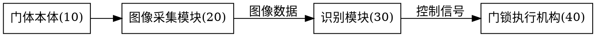

# Generating the Drawings 

Role: **discipline** of the self-service group. On completion, update the drawings stage in drafts/application-info.md.

Standards pointer: `../patent-standards/references/cn-invention-utility.md` and the applicable design reference. This skill uses the pointer; it does not reproduce statutory text.

Input: the claims + the specification text. Drawings are not free composition — they mirror the specification text (the text and drawings must use the same reference-numeral set).

## Prerequisite

```bash
dot -V   # needed only when dot-drawable figures exist (Step 2-3); if absent, state the missing dependency explicitly; do not force drawing
```

## Disclosure branch — tight (only when deliverable needs `技术交底书`)

This is the disclosed reference for the tight track. Trigger: `patent-intake` assembled a tight disclosure and needs figures.

- **Integrate first**: search `.patent/materials/` for an architecture/block or flow original — found → copy to `figures/source/` + `figures/embed/` and done.
- **Brief dot fallback**: ≤8 nodes, `rankdir=LR`, one inventive-step flow, `dot -Tpng` to `embed/figN.png` (and svg to `preview/`) if `dot` present; if `dot` absent, list in `drafts/figure-requests.md` with type + required numerals, do not block delivery.
- **Done when**: ≥1 `../figures/embed/figN.png` exists with caption `图N …`, each traceable to `§四` text; no full paper figure set copied. 简单案 1 图可过检，复杂案按需上不封顶。

Filing figures continue below — the steps are the in-file reference that every filing run needs.

## Working protocol, every step with a completion standard

### Step 1 Extract the numeral list → Done when: the list matches the specification item by item

Extract every "<name>(<numeral>)" from the specification text and build the numeral table:

```
10 门体本体     20 图像采集模块   22 红外摄像头   24 广角镜头
30 识别模块     40 门锁执行机构   50 通信接口
```

Check: parts mentioned in the text without numerals get numerals; parts you want to draw that the text never mentions — either add them to the text or don't draw them.

### Step 2 Route every figure by type → Done when: every planned figure has exactly one route — dot-drawn, integrated, or listed in the figure-requests file

Classify each figure the specification's brief description of drawings expects:

| Route | Figure types |
|---|---|
| **dot-drawn** (Step 3) | flowchart (流程图), module block / architecture diagram (框图), state-transition diagram, hierarchy / topology |
| **external** | mechanical structure views (structure / section / axonometric / partial-enlarged), circuit schematics, sequence / timing diagrams, curves & waveforms, free-form schematics (optical path, force, principle), chemical structures, GUI views |

dot expresses nodes and edges. A figure whose meaning lives in physical shapes, positions, cross-sections, or coordinates is **not** expressible in dot — never substitute a block diagram for it.

External-route figures:
- Search `.patent/materials/` for inventor-supplied originals. Found → integrate: the original as received goes to `figures/source/`, an embedding copy to `figures/embed/`; it then passes Steps 4-5 like a drawn figure.
- Not found → record it in `drafts/figure-requests.md`: figure number, type, what it must show (parts + numerals from the Step 1 list), view requirements. A utility-model structural figure in this file stays a delivery blocker (mandatory section below).

### Step 3 Draw the dot-routed figures → Done when: each figure corresponds to a specification paragraph, all numerals come from the list, and the layout is landscape and well-filled

Render with Graphviz DOT into the layered figure workspace (layout in `../patent-intake/SKILL.md` "Workspace layout"): `source/` holds the `.dot` sources and the original external figures as received, `preview/` the svg previews, `embed/` the png bitmaps used for Word embedding and filing. Output under `patents/<patent-name>/figures/`:



```bash
cd patents/<patent-name>/figures
mkdir -p source preview embed
dot -Tsvg source/fig1.dot -o preview/fig1.svg   # svg preview / version retention
dot -Tpng source/fig1.dot -o embed/fig1.png   # png for Word inline embedding / filing; black-white line art fits practice
```

The `.md` drafts (drafts/说明书.md, drafts/技术交底书.md) reference each figure as `../figures/embed/figN.png`.

**Landscape-first layout** (readability rule, applies to every dot-drawn figure): the figure must read at a glance — **width greater than height, near-rectangular, canvas well filled (饱满)**. Squint at the svg preview: a landscape rectangle with no large empty corners and no dangling outliers passes.

- Default `rankdir=LR` for chains and flows; structural diagrams stay balanced, not deep towers. Target 宽:高 roughly between 4:3 and 16:9.
- A tall narrow snake (one node per rank, many ranks) fails: regroup branches into rows (`rank=same`), or split a long sequence into two figures (each still one subject per view).
- Keep it full: uniform spacing (`nodesep`/`ranksep` close in value), parallel branches aligned, no orphan subgraph floating in a corner.

Figure checks:
- Figures are numbered "图1, 图2, …" in order, one-to-one with the "brief description of drawings" in the specification.
- No annotations beyond essential words in a figure (no parameter values, no explanatory text).
- Line style: black-white line art; no color figures, photos, or gray shading (practice).
- One view per figure, one subject per view (overall view / partial enlarged view / flowchart drawn separately).

### Step 4 Cross-check every figure, drawn or integrated → Done when: both directions, zero omissions

- Direction A: every figure listed in the "brief description of drawings" exists among the drawings.
- Direction B: every numeral in the drawings is mentioned in the specification text; the same part carries the same numeral.
- Reference numerals in the claims: only inside parentheses after the feature, never as limitations — the claims are patent-drafting's domain; here only the numeral digits are checked.

### Step 5 Designate the abstract figure → Done when: a sensible figure is chosen and recorded

When there are drawings, choose the single figure that best illustrates the technical features as the abstract figure, and record it in `drafts/附图说明.md`. Selection standard: the figure containing the independent claim's distinguishing feature (usually the system architecture figure or the main flowchart), not a partial detail figure.

## Utility model mandatory items

A utility model **must** have drawings showing the shape / construction / combination of the product. Where the protected construction is physical shape or assembly, this is a **structure view — an external-route figure**; a block diagram alone does not carry shape/construction and does not satisfy the mandate. Missing structural drawings are a delivery blocker: route the need through `drafts/figure-requests.md` instead of substituting a block diagram.

## Design (外观设计, six-view trigger → redirect)

A design's "drawings" are **pictures or photographs** not dot-rendered line diagrams — **dot does not apply**. The view rules (number of views per the faces the design points involve, six orthographic views, omitted-view statements, black-white/gray, view naming) have their single executable version in `../patent-intake/references/design-points.md`; this skill does not repeat the rules.

## Completion standard (before handover)

- [ ] Every figure routed (Step 2): dot-drawn, integrated from `.patent/materials/`, or listed in `drafts/figure-requests.md`
- [ ] Numeral list matches the specification text in both directions (Steps 1 + 4), for drawn and integrated figures alike
- [ ] Figure-number order consistent with the brief description of drawings
- [ ] Black-white line art, no stray annotations (integrated originals that violate get flagged to the inventor, not silently accepted)
- [ ] Landscape, near-rectangular, well-filled layout for every dot-drawn figure
- [ ] Abstract figure designated (utility model: structural figure preferred)
- [ ] Utility model: has a structural figure (external structure view where shape/construction is physical)
- [ ] Drawn figures produced as both `preview/figN.svg` and `embed/figN.png`; integrated figures present in `source/` + `embed/` (Word embedding figures generated, none missing)
- [ ] drawings stage updated in drafts/application-info.md
